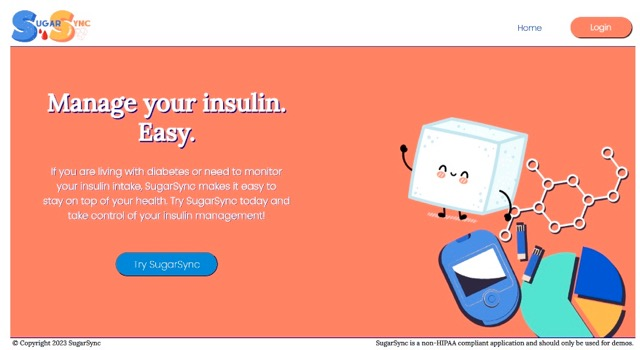
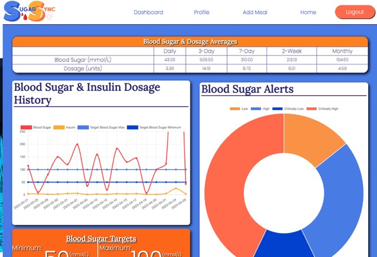
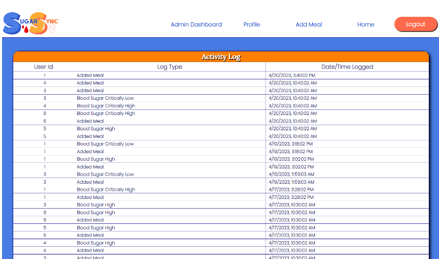

# Final Capstone
​SugarSync Insulin Tracker Application
- Designed and developed full stack application enabling diabetic users to register/login, log meals, calculate their insulin dose, track their insulin/blood sugar history, and receive alerts. 
- Utilized Java, Spring framework, and PostgreSQL for the backend, adhering to MVC principles and utilizing RESTful APIs. 
- Utilized JavaScript, Vue.js, and Chart.js for frontend and data visualization. 

This directory contains all of the starter projects for the final capstone: 
- /java folder for backend project (Springboot, PostgreSQL)
- /vue folder for frontend project (Vue.js, HTML,CSS, JavaScript, Charts.js)

Screenshots below: 

​

